# IGMP原理

组播通信中，组播网络需要将组播数据发送给特定的组播组成员，因此组播网路需要知道组成员的位置与组成员所加的组播组。

通过IGMP(Internet Group Management Protocol，因特网组管理协议)，组成员可以将加组消息发送给组播网络，从而让组播网络感知到组成员的位置和所加组播组。

IGMP通过在组播组成员和组播路由器之间交换IGMP报文实现组成员管理功能，IGMP报文封装在IP报文中。

到目前为止，IGMP有三个版本：

IGMPv1

IGMPv2

IGMPv3

组播路由器与组成员间交互报文后会生成**IGMP路由表项**与**IGMP组表项**。

IGMP组表项是由用户主机发送的IGMP加入报文创触发建，用于维护组加入信息并通知组播路由协议(一般是PIM)创建相应(*，G)表项。

IGMP路由表项的作用主要是用来扩展组播路由表项的出接口。

> [!NOTE]
>
> 上游数据通过组播路由到达本地路由器时需要查询~~IGMP路由表项~~(实际是组播路由表)向对应网段的出接口转发

## IGMPv1
---
### 基本概念

普遍组查询报文(general query)：查询器向共享网络上所有主机和路透其发送的查询报文，用于查询哪些组播组存在成员。

成员关系报告报文(report)：主机向查询器发送的报告报文，用于申请加入某个组播组或者应答查询报文。

由于IGMP报文是组播报文，所以只需要一个组播路由器充当**IGMP查询器(querier)**发送查询报文即可

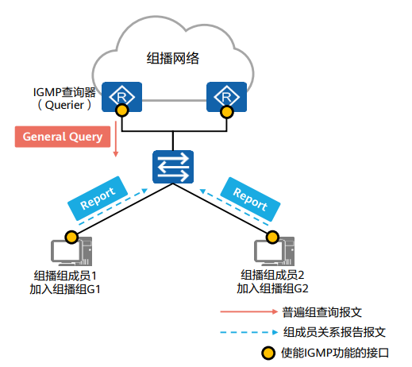

### 报文格式

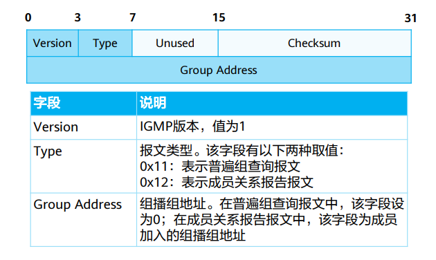

### 加组流程

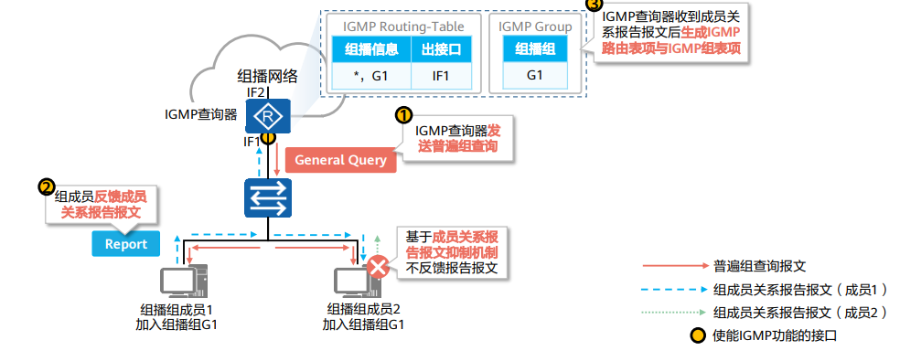

> [!NOTE]
> 
> report报文该网段同一组播组主机只需要发出一份即可，所以产生了成员关系报文抑制机制，减少网段上的流量

### IGMPv1查询器选举机制

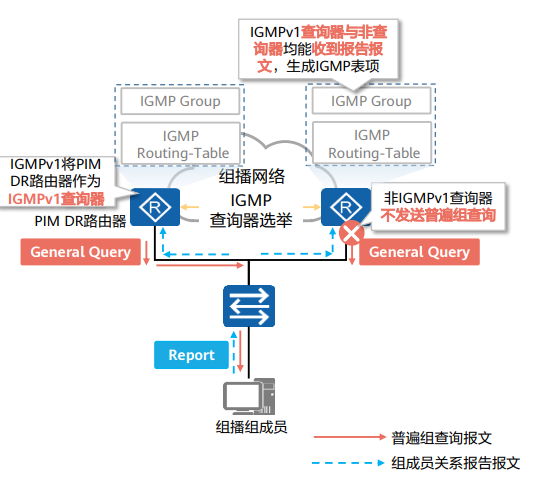

Q:为什么要选举？

A:因为普遍组查询是组播报文，因此同一网段内只需要一台查询器即可查询所有组成员的加组信息。

IGMPv1没有基于IGMP的查询器选举机制，所以需要依赖组播路由协议(PIM)进行IGMP查询器选举。

Q:难道只需要一台路由器发送查询报文？另外的路由器怎么办呢？

A:是的，因为查询器和非查询器均能收到成员关系报告(目的地址224.0.0.1)，因此均能形成IGMP路由表与IGMP组表项。

### IGMPv1组成员离组机制

使用超时机制，组成员离开组播组后将不回应普通组查询报文，查询器缺省130s内未收到该网段报告报文，删除表项。

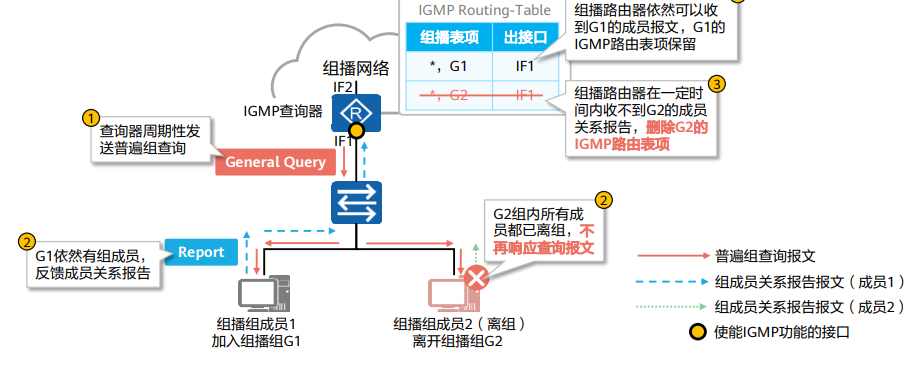

## IGMPv2
---
### 介绍

IGMPv2迭代v1，能兼容v1

v2组成员加组机制与v1一致

v2增加了离开组机制

v2增加了查询器选举机制

### 报文格式

新增两种报文

成员离开报文(leave)：成员离开组播组时主动向查询器发送的报文，用于宣告自己离开了某个组播组。成员离开报文目的地址为224.0.0.2。

特定组查询报文(group-specific query)：查询器向共享网段内指定组播组发送的查询报文，用于查询该组播组是否存在成员。特定组查询报文目的地址为所查询组播组的组地址。

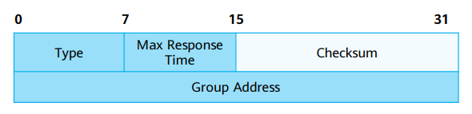

IGMPv2查询器选举机制

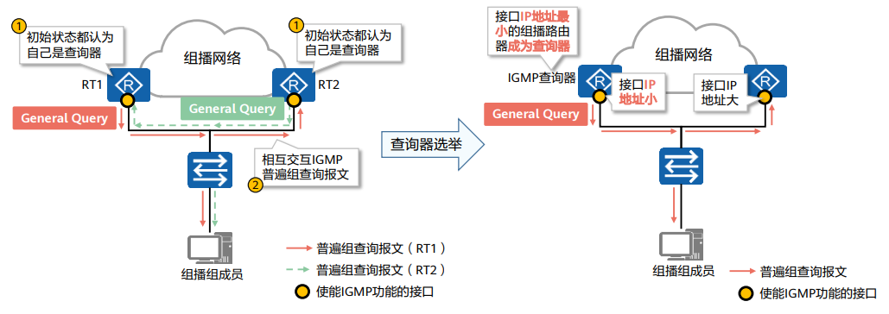

非查询器定时器超时未收到查询器发送的查询报文，认为失效，发起新的查询器选举

IGMPv2组成员离开机制

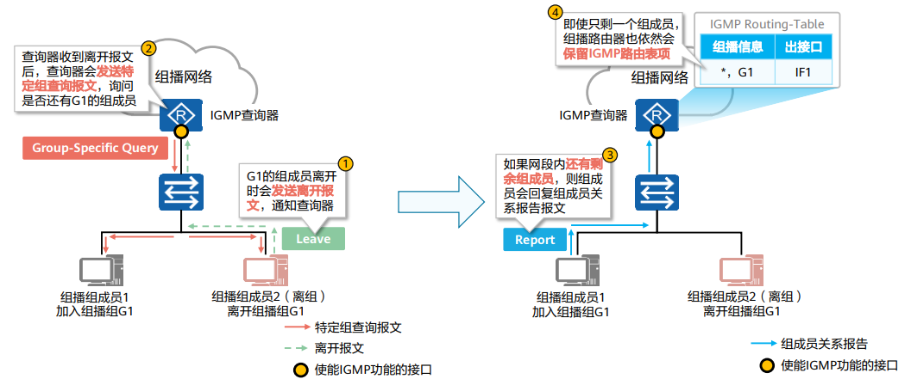

## IGMPv3
---
IGMPv3主要是为了配合SSM(source-specific multicast)模型发展起来的，提供了在报文中携带组播源信息的能力，即主机可以对组播源进行选择。

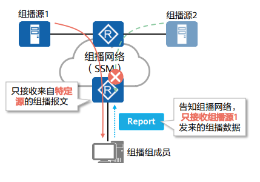

### 介绍

相比v2新增特定源组查询报文(group-and-source-specific query)。

IGMPv3成员关系报告报文不仅包含主机想要加入的组播组，而且包含主机想要接收来自哪些组播源的数据

由于同个组播组的不同成员可能希望接受来自不同源的组播，因此IGMPv3无需成员关系报告报文抑制机制。

IGMPv3没有定义专门的成员离开报文，成员离开通过特定类型的报告报文来传达。

### 报文格式

普遍组查询报文(general query)：同v1，v2

特定组查询报文(group-specific query)：同v2

特定源组查询报文(group-and-source-specific query)：该报文用于查询该组成员是否愿意接收特定源发送的数据。特定源组查询通过在报文中携带一个或多个组播源地址来达到这一目的。

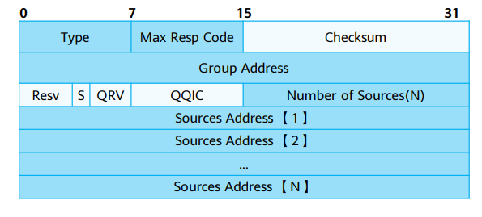

### 成员关系报告报文

除了通告组成员的加组信息，还能通告组成员希望接收的组播源信息。可选择接收或者过滤。目的地址为224.0.0.22。

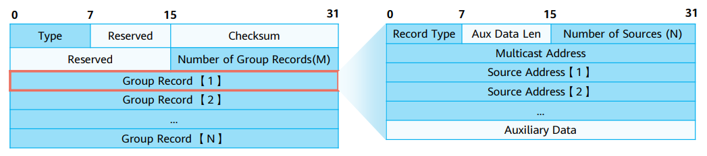

### IGMPv3组成员离组机制

IGMPv3没有专门的成员离开报文，成员离开需要借助组成员关系报告实现。

IGMP查询器在收到改变源组对应关系的成员关系报告后，会发送特定源组查询报文，确认是否还有组成员存在。

## 各版本间差异
---
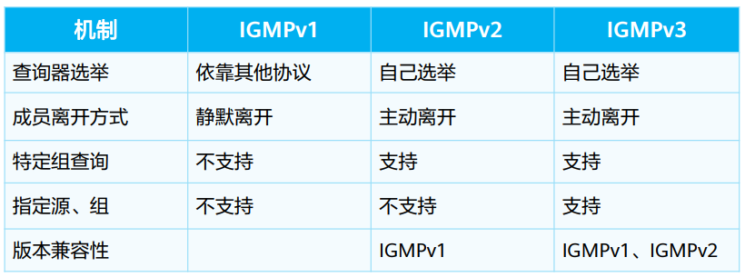

## IGMP Snooping
---
### 以太网的组播转发问题

当组播数据从最后一跳路由器发往组播组成员时，往往会经过交换机。由于组播数据的目的MAC地址是组播MAC地址，默认情况下交换机将泛洪此类数据帧，有可能导致不同组的组播流量会被别组的成员接收。

IGMP Snooping功能可以控制组播流量在以太网的泛洪范围，避免不同组的组播流量被别组成员接收。

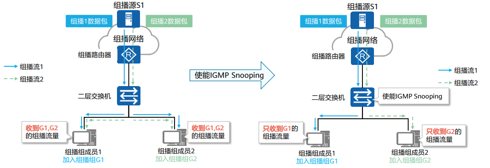

### 工作原理

IGMP Snooping设备通过监听IGMP报文，形成二层组播转发表，并决定接口类型(路由器端口和成员端口)
