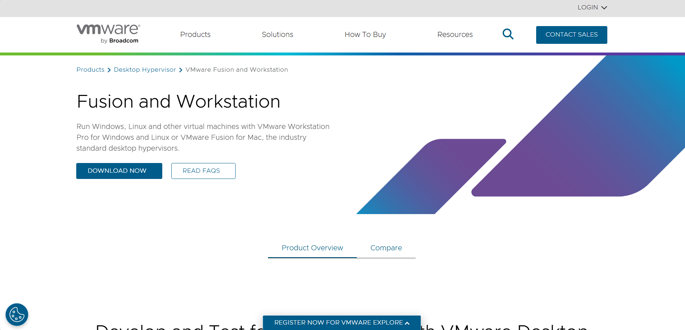
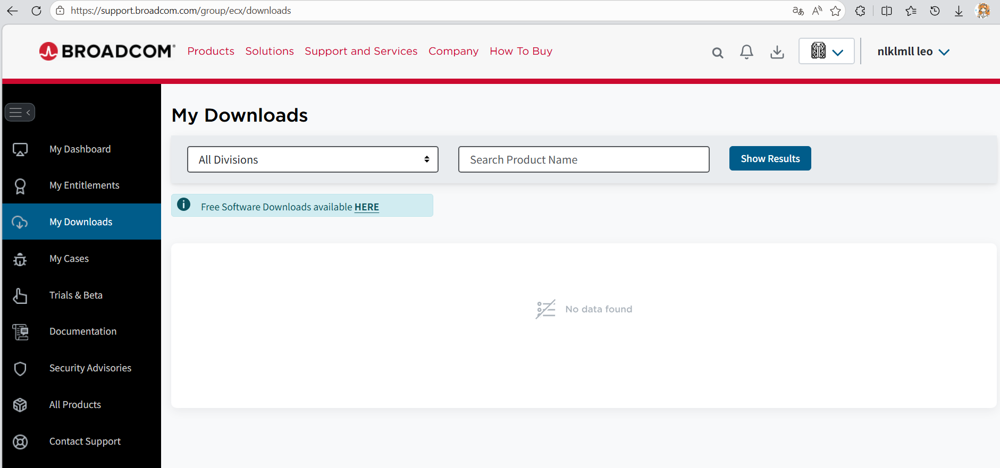
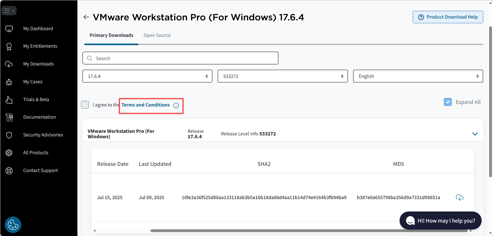
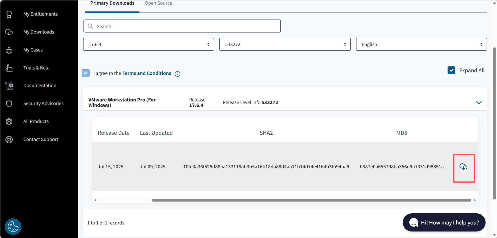

# VMware Pro下载与安装


打开官网链接：[Fusion and Workstation | VMware](https://www.vmware.com/products/desktop-hypervisor/workstation-and-fusion)



点击download now

vmware已经被broadcom收购，需要注册一个博通账号，最好用国外域名的邮箱，后面会讲为什么。

登录后进到以下页面，点击**HERE**



拉到最下，选择VMware Workstation Pro。


选择需要的版本(这里以17.6版本为例)

需要先点击**Terms and Conditions**，不用仔细看这个条款，直接回到原页面再勾选左边方框同意条款和协议。



然后就能点击云朵标志开始下载



如果提示

```
Account verification is Pending. Please try after some time
```

是因为账户原因，更换一个邮箱注册新的账户(最好是外国邮箱)再次尝试。

下载成功后打开安装程序

根据提示一步步安装

