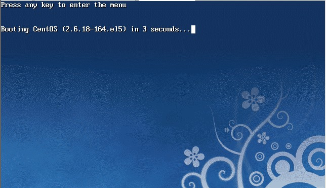
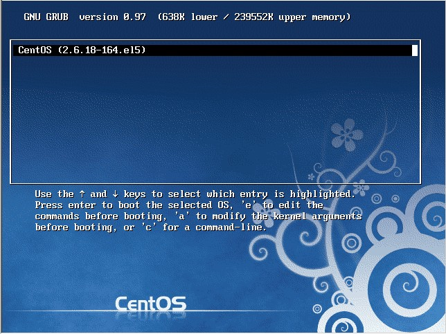
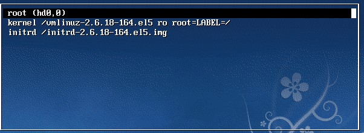
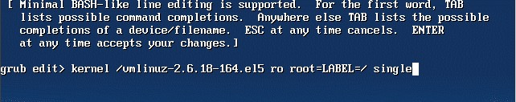
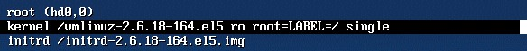
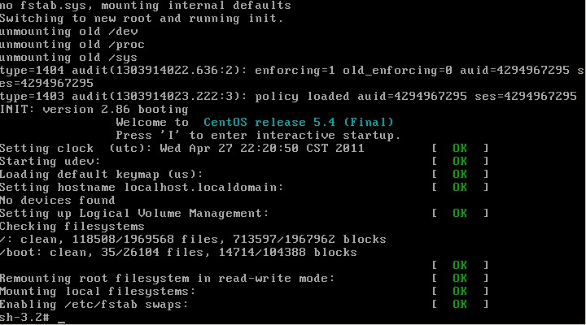
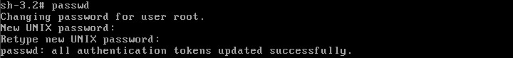

# Linux


命令大全[Linux 命令大全 | 菜鸟教程](https://www.runoob.com/linux-command-manual.html)


#### 关机命令

shutdown 会给系统计划一个时间关机。它可以被用于停止、关机、重启机器。shutdown 会给系统计划一个时间关机。它可以被用于停止、关机、重启机器。

```
# shutdown -p now  ### 关闭机器
# shutdown -H now  ### 停止机器      
# shutdown -r 09:35 ### 在 09:35am 重启机器
```

要取消即将进行的关机，只要输入下面的命令：

```
# shutdown -c
```

halt 命令通知硬件来停止所有的 CPU 功能，但是仍然保持通电。你可以用它使系统处于低层维护状态。注意在有些情况会它会完全关闭系统。

```
# halt             ### 停止机器
# halt -p          ### 关闭机器、关闭电源
# halt --reboot    ### 重启机器
```

poweroff 会发送一个 ACPI 信号来通知系统关机。

```
# poweroff           ### 关闭机器、关闭电源
# poweroff --halt    ### 停止机器
# poweroff --reboot  ### 重启机器
```

reboot 命令 reboot 通知系统重启。

```
# reboot           ### 重启机器
# reboot --halt    ### 停止机器
# reboot -p        ### 关闭机器
```


#### 忘记密码

重启linux系统



3 秒之内要按一下回车，出现如下界面



然后输入e



在 第二行最后边输入 single，有一个空格。具体方法为按向下尖头移动到第二行，按"e"进入编辑模式



在后边加上single 回车



最后按"b"启动，启动后就进入了单用户模式了



此时已经进入到单用户模式了，你可以更改root密码了。更密码的命令为 passwd




#### 处理目录的常用命令

- ls（英文全拼：list files）: 列出目录及文件名
- cd（英文全拼：change directory）：切换目录
- pwd（英文全拼：print work directory）：显示目前的目录
- mkdir（英文全拼：make directory）：创建一个新的目录
- rmdir（英文全拼：remove directory）：删除一个空的目录
- cp（英文全拼：copy file）: 复制文件或目录
- rm（英文全拼：remove）: 删除文件或目录
- mv（英文全拼：move file）: 移动文件与目录，或修改文件与目录的名称

你可以使用 *man [命令]* 来查看各个命令的使用文档，如 ：man cp。


#### Linux 文件内容查看

Linux系统中使用以下命令来查看文件的内容：

- cat 由第一行开始显示文件内容
- tac 从最后一行开始显示，可以看出 tac 是 cat 的倒着写！
- nl  显示的时候，顺道输出行号！
- more 一页一页的显示文件内容
- less 与 more 类似，但是比 more 更好的是，他可以往前翻页！
- head 只看头几行
- tail 只看尾巴几行

你可以使用 *man [命令]*来查看各个命令的使用文档，如 ：man cp。

