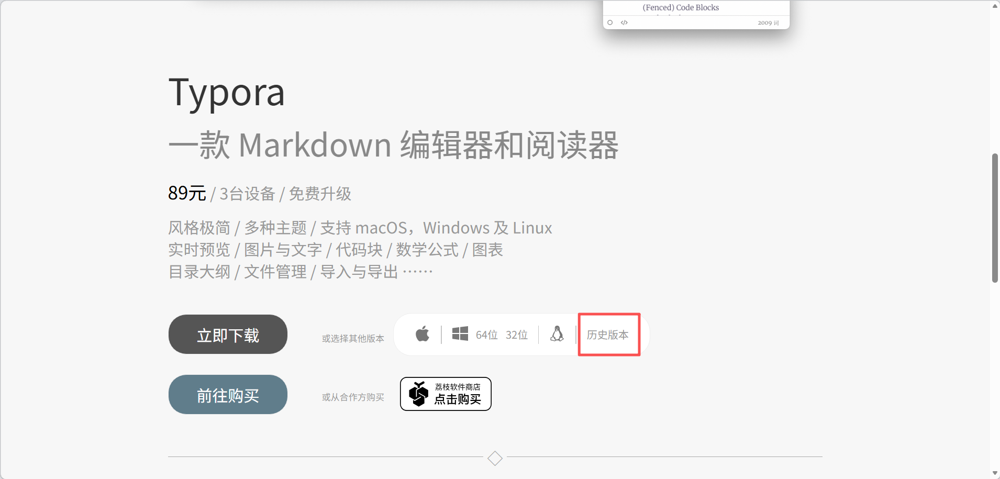
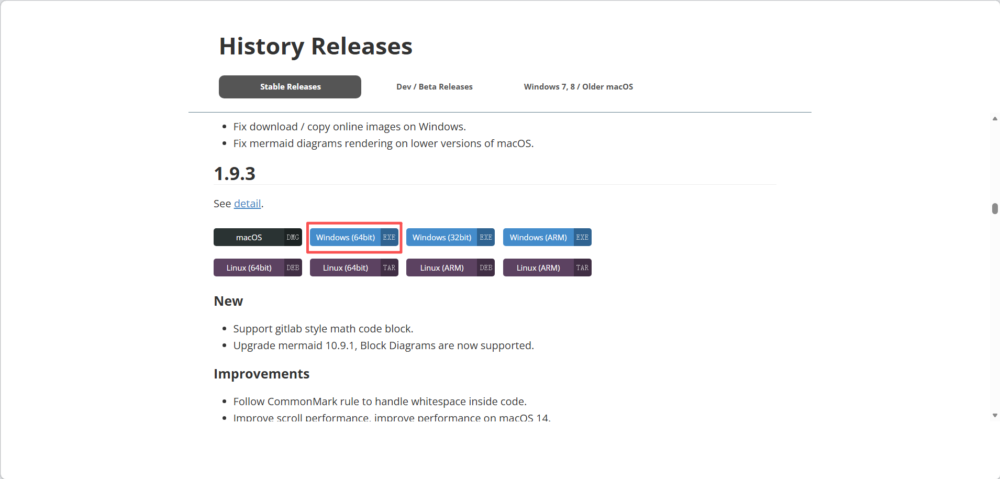
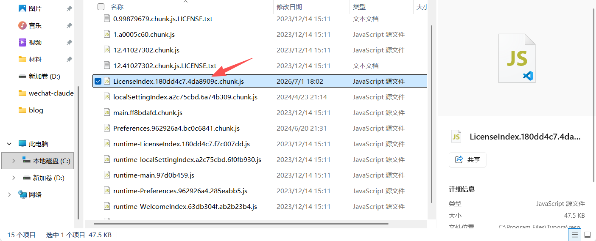
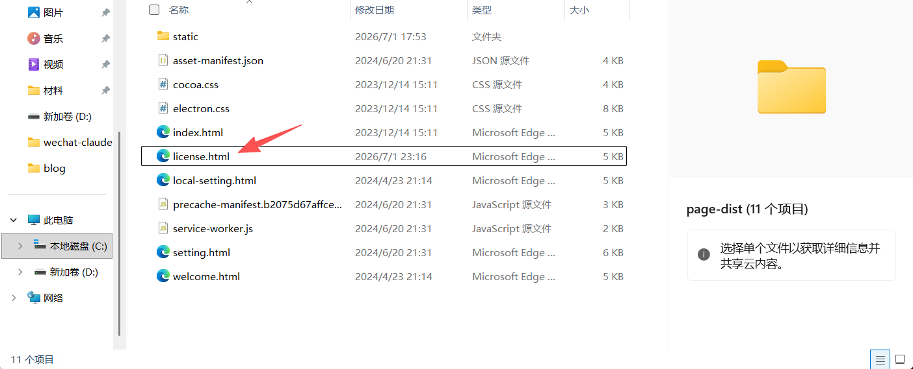

# 激活正版Typora


> [!CAUTION]
>
> 该方法仅适用于1.10以下版本


#### 1、下载正版Typora

打开Typora官网https://typoraio.cn/，选择历史版本



往下找到1.9.3下载



下好后启动安装程序，按照提示正常安装，记住安装路径。

#### 2、激活

安装后打开文件目录，你的路径不一定是这个！

```
C:\Program Files\Typora\resources\page-dist\static\js
```

用文本编辑器打开这个文件



Ctrl+F查找：

```
e.hasActivated="true"==e.hasActivated`
```

替换成：

```
e.hasActivated="true"=="true"
```

保存后启动Typora，提示已激活。

#### 3、自动关闭已激活弹窗

在安装目录中找到文件**license.html**

```
..\Typora\resources\page-dist
```



用文本编辑器打开，Ctrl+F查找：

```
</body></html>
```

替换成：

```
</body><script>window.onload=function(){setTimeout(()=>{window.close();},500);}</script></html>
```

保存后重启typora，弹窗激活500ms后会自动关闭，如果报错可增加时间。

