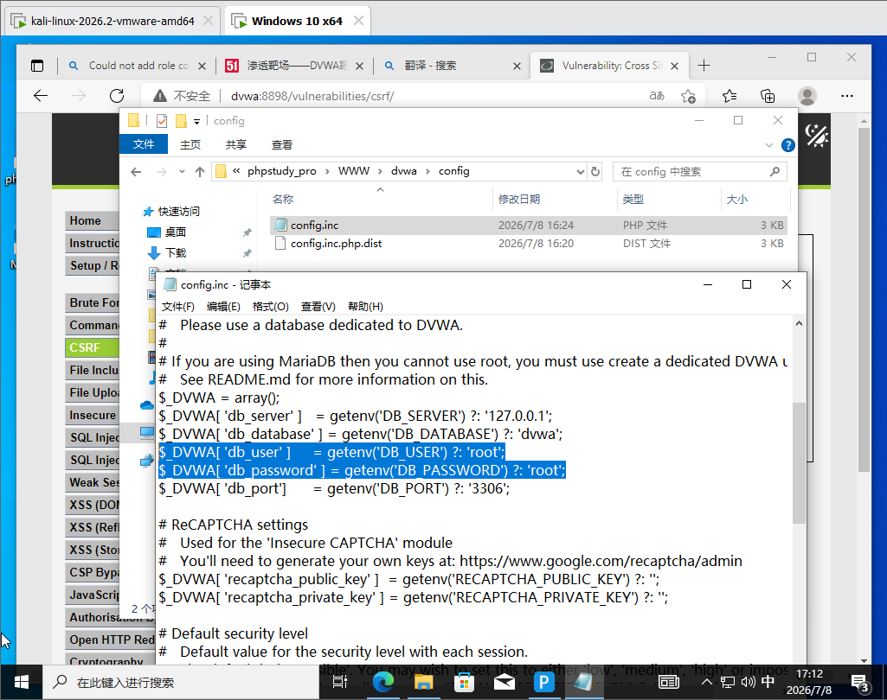
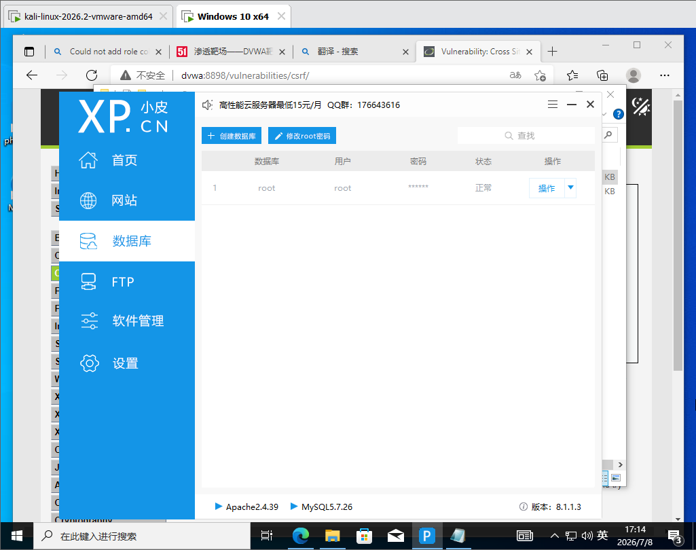
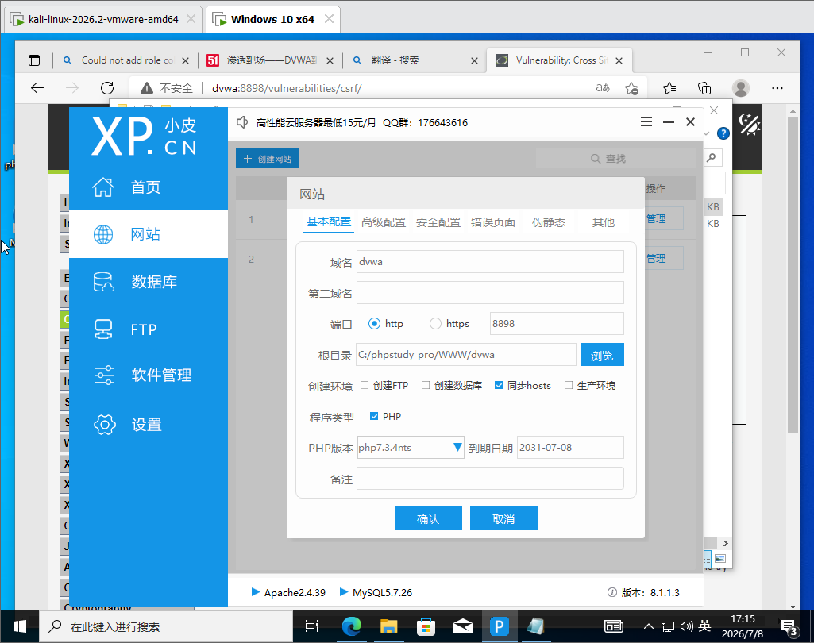
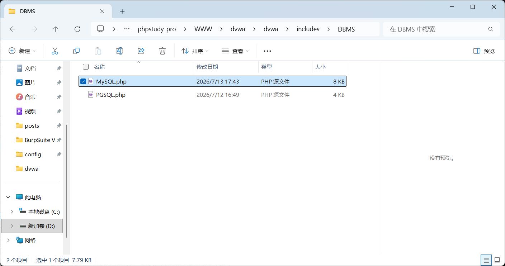
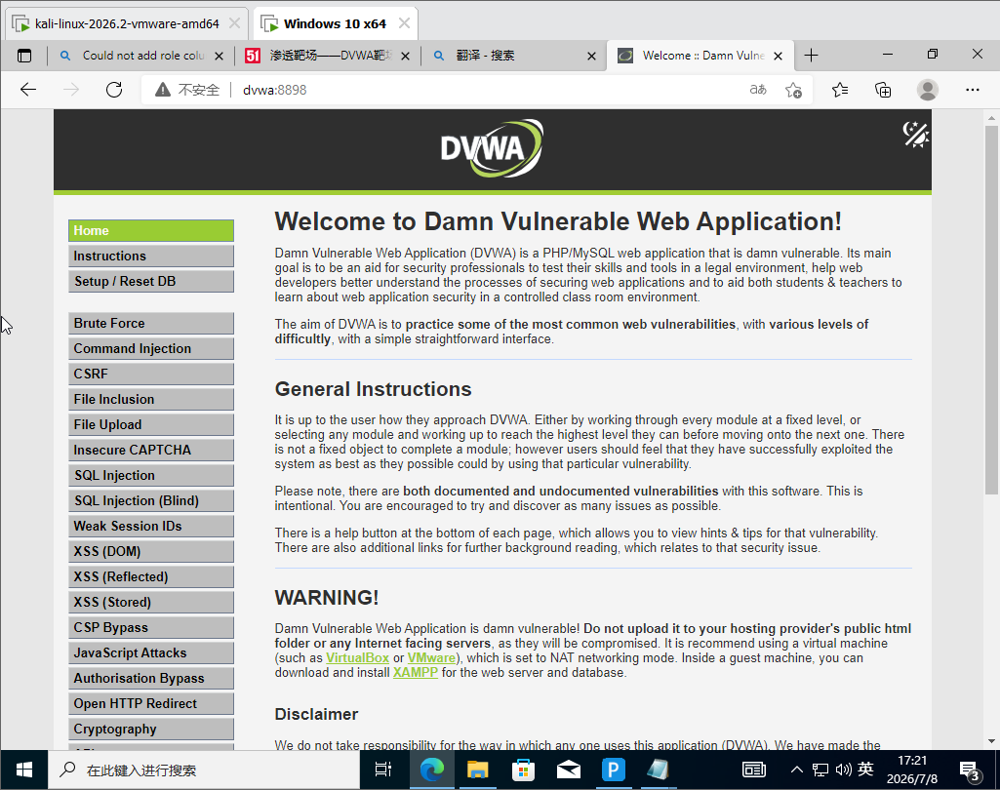
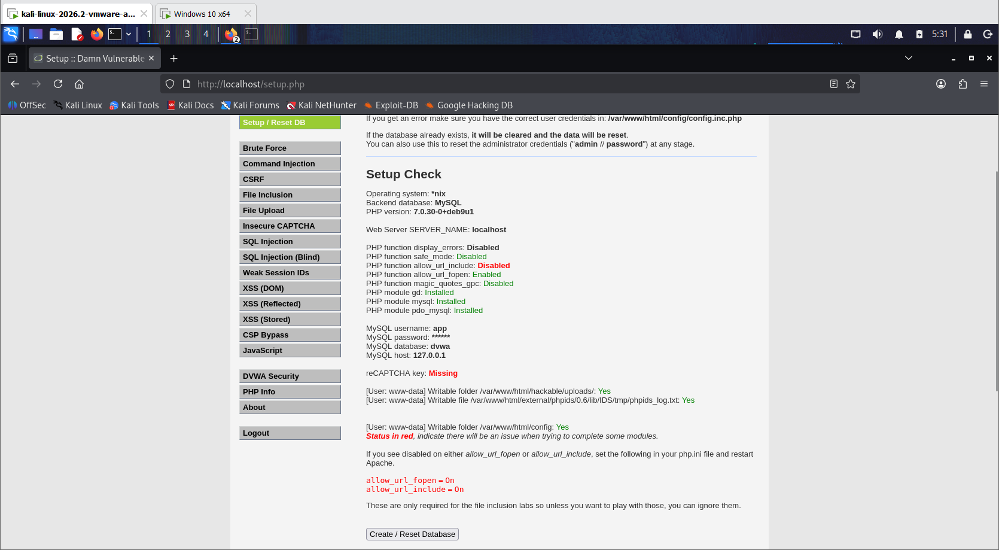

# 搭建DVWA靶场


### Windows版

1. 去 phpstudy 官网（[xp.cn](https://xp.cn)）下载 phpstudy_pro，安装

2. 面板里启动 Apache + MySQL 两个服务，看到绿灯就是正常

3. 下载 DVWA 源码（GitHub：[https://github.com/digininja/DVWA](https://github.com/digininja/DVWA)，点 Code → Download ZIP）

4. 解压后整个文件夹丢进 phpstudy 的网站根目录（一般是 `phpstudy_pro\WWW\`），重命名为 `dvwa`

5. 改配置：进 `dvwa\config\` 把 `config.inc.php.dist` 复制一份改名 `config.inc.php`，用记事本打开，把数据库账号密码改成 phpstudy 的（默认都是 `root`/`root`）

   

6. 打开小皮面板创建数据库，用户名密码和文件修改后的保持一致

   

7. 创建网站，填写域名，修改端口号，其他不动，确定后重启服务

   

8. 浏览器访问 `http://127.0.0.1/dvwa：8898`，输入账密登录，点最下面 **Create / Reset Database**

   > [!NOTE]
   >
   > 如果出现初始化问题参考[如何搭建 DVWA 靶场保姆级教程（附链接）_dvwa靶场搭建-CSDN博客](https://blog.csdn.net/2302_82189125/article/details/135834194)

   补充：如果提示（这是dvwa和mysql版本的语法兼容性问题）

   ```
   Could not add role column to users table SQL: You have an error in your SQL syntax; check the manual that corresponds to your MySQL server version for the right syntax to use near 'IF NOT EXISTS role VARCHAR(20) DEFAULT 'user'' at line 1。
   ```

   找到这个文件

   

   搜索`IF NOT EXISTS`，将其删除保存

   刷新浏览器再次执行初始化。

9. 重新打开登录页面，登录

10. 完成

   


### Linux版

#### 1、安装docker(已安装可跳过)

按顺序在 Kali 终端敲（需要 root，命令前的 `sudo` 别漏）：

```bash
# 1. 更新软件源
sudo apt update

# 2. 安装 docker.io（Kali/Debian 源里自带，最简单）
sudo apt install -y docker.io

# 3. 启动 docker 服务，并设为开机自启
sudo systemctl enable docker --now

# 4. 验证是否装好
sudo docker --version
```

看到类似 `Docker version 20.x.x` 就说明装成功了。

#### 2、免 sudo 用 docker

把当前用户加进 docker 组，以后不用每条命令都打 sudo：

```bash
sudo usermod -aG docker $USER
```

⚠️ 这步之后**必须重新登录**（注销再登录，或直接重启 Kali）才生效。嫌麻烦就先跳过，后面命令都带 `sudo` 也行。

#### 3、拉起DVWA

```bash
sudo docker run -d -p 80:80 --name dvwa vulnerables/web-dvwa
```

如果报错

```
Unable to find image 'vulnerables/web-dvwa:latest' locally docker: Error response from daemon: Get "https://registry-1.docker.io/v2/": net/http: request canceled while waiting for connection (Client.Timeout exceeded while awaiting headers)
```

直接看4修改下载源

跑完确认容器在运行：

```bash
sudo docker ps
```

能看到名为 `dvwa` 的容器、状态 `Up` 就对了。

容器管理常用命令:

| 命令                | 作用                   |
| ------------------- | ---------------------- |
| `docker ps`         | 看正在运行的容器       |
| `docker ps -a`      | 看所有容器(含已停止的) |
| `docker start dvwa` | 启动已停止的容器       |
| `docker stop dvwa`  | 停止容器               |
| `docker rm -f dvwa` | 强制删除(运行中也能删) |

#### 4、配镜像加速源

编辑（没有就新建）daemon.json：

```bash
sudo nano /etc/docker/daemon.json
```

粘贴以下内容（多个源，一个不行会自动试下一个）：

```json
{
  "registry-mirrors": [
    "https://docker.1ms.run",
    "https://docker.1panel.live",
    "https://hub.rat.dev",
    "https://docker.m.daocloud.io"
  ]
}
```

`nano` 里保存：`Ctrl+O` → 回车 → `Ctrl+X` 退出。

重启 Docker 让配置生效：

```bash
sudo systemctl daemon-reload
sudo systemctl restart docker
```

确认加速源已加载（输出末尾能看到 Registry Mirrors 列表）：

```bash
sudo docker info
```

然后重新拉：

```bash
sudo docker run -d -p 80:80 --name dvwa vulnerables/web-dvwa
```

#### 5、访问

在 Kali 自己浏览器访问：`http://127.0.0.1`

登录页用 `admin` / `password`，进去后先点 **Create / Reset Database**，再把 **DVWA Security** 调到 **Low**。



完成。