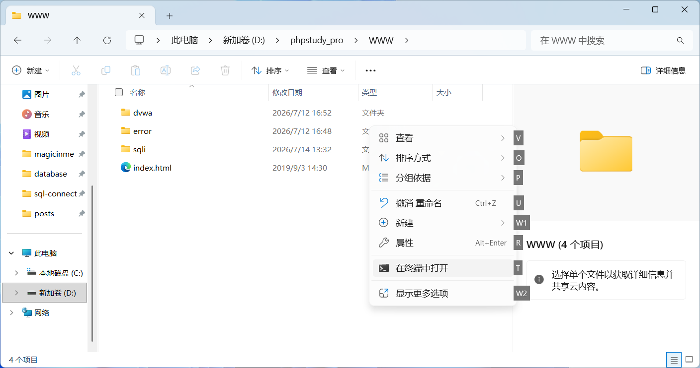
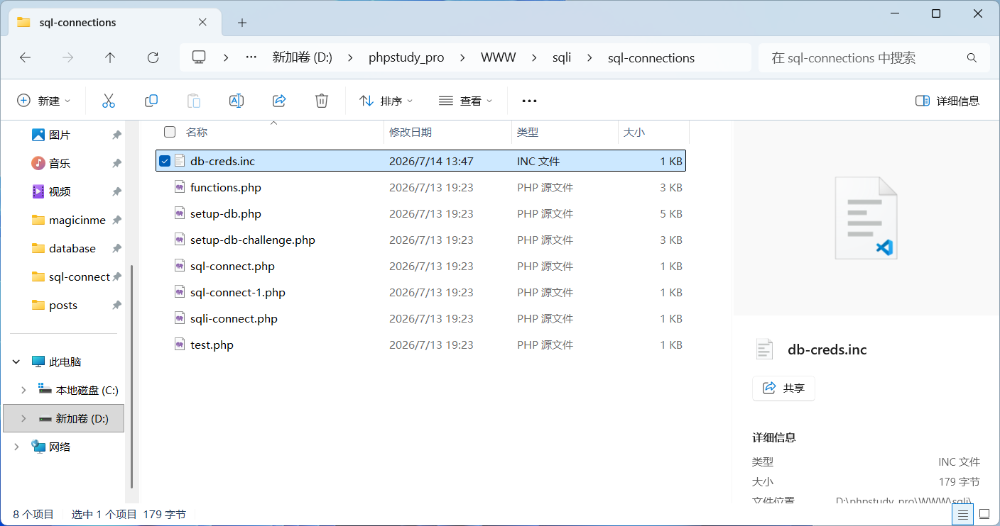
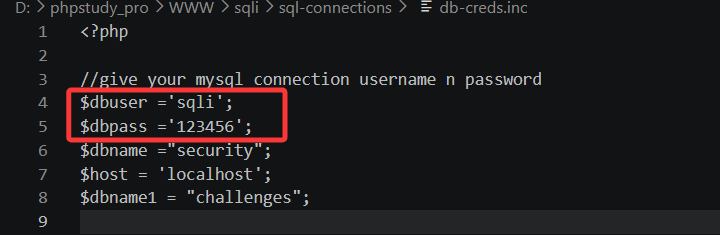
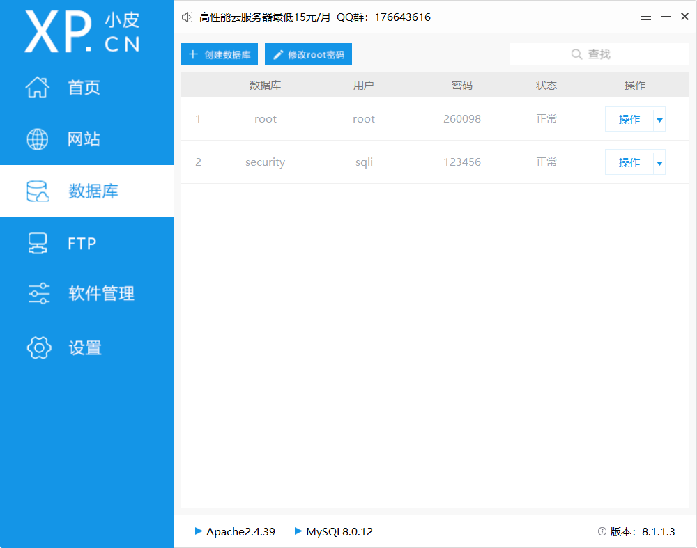
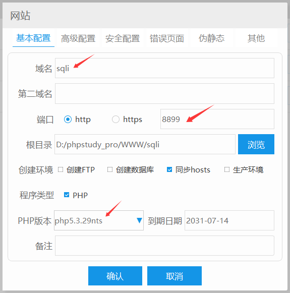
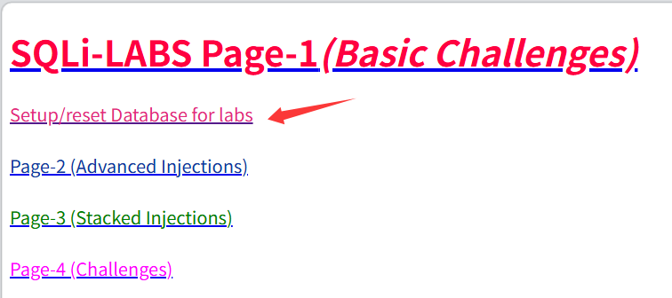
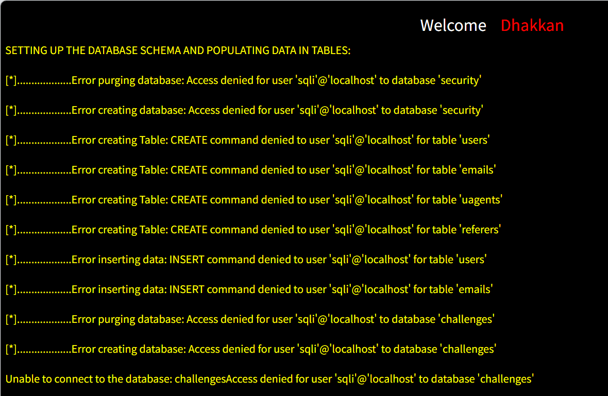

# 搭建sqli-labs靶场(win)


#### 1、安装好phpstudy

省略。详见文章[搭建DVWA靶场](.\搭建DVWA靶场.md)

#### 2、下载

在`..\phpstudy_pro\www`路径下打开**cmd**，执行

```
 git clone https://github.com/Audi-1/sqli-labs.git sqli-labs
```



#### 3、修改密码

在`phpstudy_pro\WWW\sqli\sql-connections`找到文件打开。



修改user和pwd和接下来要创建的数据库名和密码一样



#### 4、创建数据库

在phpstudy新建数据库，用户名密码设成前一步骤中修改好的账密



#### 5、创建网站

新建网站，填好域名，修改未冲突端口号，php版本改成**5.3.29nts**。



#### 6、初始化数据库

访问`localhost:port`，点击**setup/reset database for labs**



#### 7、完成

